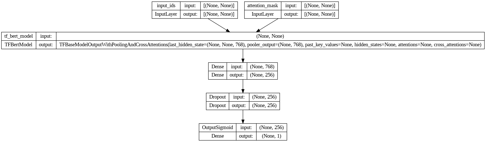

# Sentiment Analysis with ParsBERT + MLP

This project focuses on **Sentiment Analysis (Binary Classification)** using a fine-tuned **ParsBERT** transformer model combined with a **Multi-Layer Perceptron (MLP)** classifier. The main objective is to automatically classify Persian user comments into **positive** or **negative** categories.

---

## Dataset
- **Source**: Snapp comments dataset (originally used for collecting student feedback on instructor evaluations).
- **Language**: Persian (Farsi).
- **Challenges**: Raw data included noise, inconsistent spellings, stopwords, and special characters.
- **Preprocessing**: Applied a **custom JackageNormalizer** function.
- **shape**: (65973, 4)
- **columns**: (comment, label, comment_length, comment_cleaned)

---

## Hazm Library Issue
The well-known **Hazm** library (for Persian NLP) had compatibility issues with the TensorFlow environment:
- Hazm depends on `numpy < 1.26.4`, while TensorFlow requires newer versions.
- This conflict prevented smooth training and deployment.

**Solution**: A **custom `JackageNormalizer`** was implemented to replace Hazm. It includes 9 normalization steps:

1. Normalize Unicode
2. Remove unwanted characters
3. Convert numbers
4. Convert numbers to words
5. Standardize Persian text
6. Remove keshide
7. Remove punctuation
8. Fix Persian ZWNJ
9. Remove stopwords

---

## Tokenizer

Since NLP models process numeric data, not text, there must be a translation between text and tokens. A token is an integer that represents a character or a short segment of characters. On the input side, the input text is parsed into a sequence of tokens. Similarly, on the output side, the output tokens are parsed into text. The module that performs the conversion between texts and token sequences is a tokenizer, and each model on the Hugging Face site has its own tokenizer, which we use to tokenize the ParsBERT model for our data.
The (model_tokenizer) converts each text into token IDs and generates the required attention masks.specifies that any text longer than the maximum length will be truncated with using (truncation=True) and with using (padding=True) ensures that all sequences are padded to the same length.

---

## Model learning environment
Set TensorFlow to use the legacy Keras implementation for compatibility.

- Uses `TF_USE_LEGACY_KERAS=1` so TensorFlow routes Keras APIs to the legacy Keras package. This can avoid serialization/saving/loading mismatches between tf.keras 3.x and older code.

```python
import os
os.environ['TF_USE_LEGACY_KERAS'] = '1'
```
---

## Model Architecture
The architecture integrates **ParsBERT embeddings** with a neural classification head:

- **Inputs**: `input_ids`, `attention_mask`
- **Base model**: `TFBertModel` (ParsBERT)
- **Hidden layers**:
  - Dense layer: 768 → 256 (GeLU activation)
  - Dropout for regularization
  - Final Dense layer: 256 → 1 (Sigmoid activation for binary classification)

**Model Diagram:**



---

## Training Procedure
Training was performed on **Google Colab (T4 GPU)**.

Two training phases were used:
```
Total params: 163038465 (621.94 MB)
```

### Stage 1: Fine-Tuning (20 epochs) + ```transformers.trainable = False```
```
Non-trainable params: 162841344 (621.19 MB)
Trainable params: 197121 (769.50 KB)
```
- Optimizer: AdamW
- Learning rate: `1e-5`
- Achieved ~80% validation accuracy by epoch 20, with AUC around 0.88.

### Stage 2: Fine-Tuning (5 epochs) + Unfroze last 2 encoder layers
```
Trainable params: 92159745 (351.56 MB)
Non-trainable params: 70878720 (270.38 MB)
```
- Reduced learning rate: `5e-6`
- Optimizer: AdamW
- Achieved ~87% validation accuracy and AUC of 0.94.

**Key Observations:**
- Model converged well in early epochs.
- Some overfitting was observed after epoch 3 in stage 2.
- Best balance between accuracy and generalization was achieved around epoch 3–4.

---

##  Adam vs AdamW
- **Adam**: Fast convergence, but weaker generalization due to weight decay handling.
- **AdamW**: Decouples weight decay from gradient updates → better generalization.

**In this project**: Adam was useful for initial prototyping, but AdamW produced more stable results and higher validation performance.

---

## User Interface (Streamlit)
A simple **Streamlit application** was built to demonstrate the model in action:
1. User enters a Persian text comment.
2. The text undergoes preprocessing:
   - Normalization
   - Spell correction (via external API)
3. The processed input is passed to the model.
4. Output: Sentiment prediction (**Positive / Negative**).


---

## Spell Correction
Because user-generated text often contains typos:
- An external **Spell Checking API** was integrated.
- If a typo is detected, the corrected word is substituted.
- If no error exists, the original word remains unchanged.

This step significantly improved model accuracy on noisy input.

---

## Project Highlights
- Fine-tuned **ParsBERT** with a custom **MLP head**.
- Replaced Hazm with a robust **custom normalizer**.
- Achieved high performance on noisy Persian dataset.
- Deployed a **Streamlit UI** for real-world testing.

---

## Future Work
- Add **data augmentation** for better generalization.
- Deploy as a **Hugging Face model** with a pipeline for wider access.
---

```@article{ParsBERT,
    title={ParsBERT: Transformer-based Model for Persian Language Understanding},
    author={Mehrdad Farahani, Mohammad Gharachorloo, Marzieh Farahani, Mohammad Manthouri},
    journal={ArXiv},
    year={2020},
    volume={abs/2005.12515}
}
```
